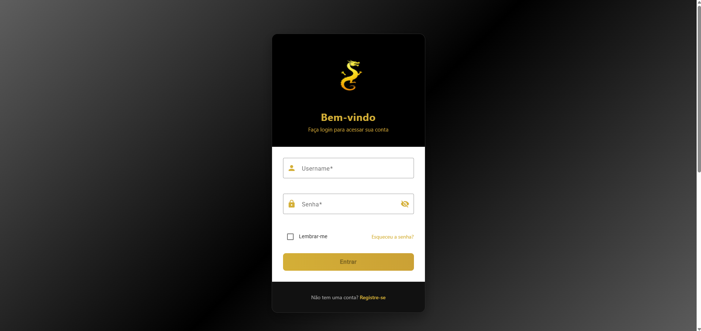
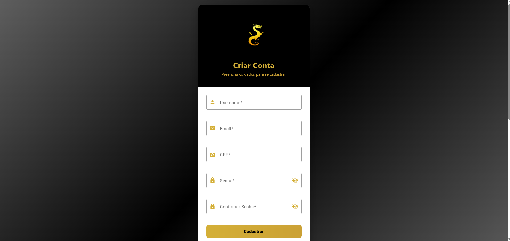
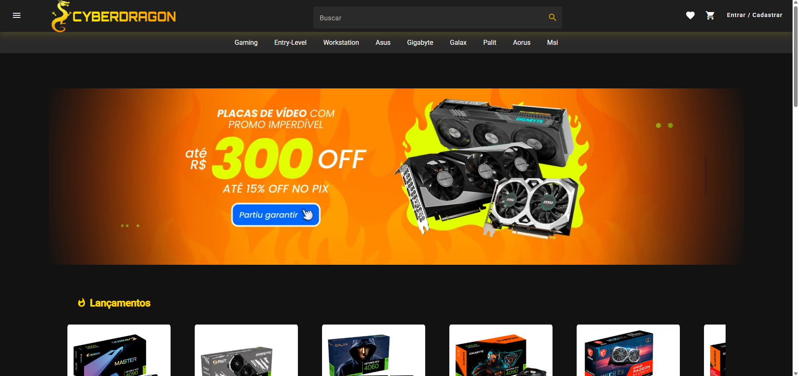
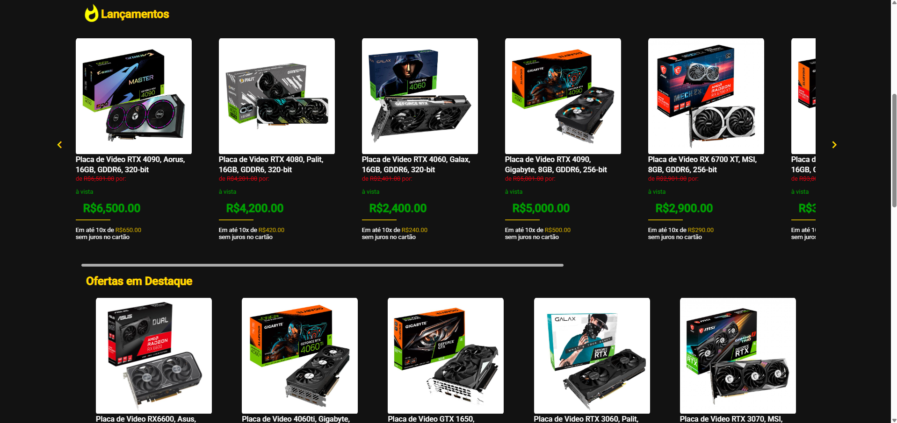
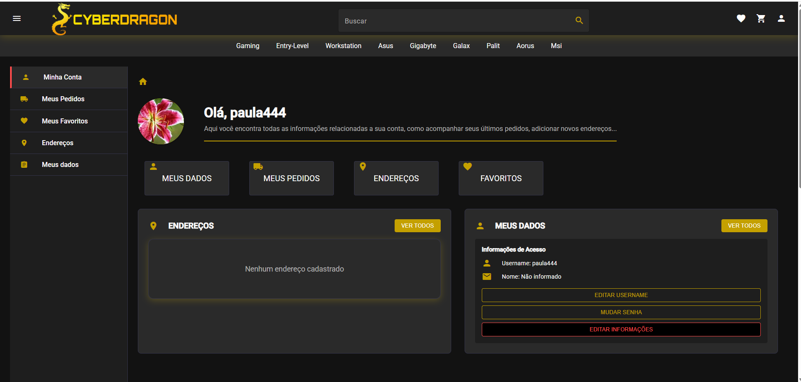

# 🐉 CyberDragon  
### Um e-commerce moderno de placas de vídeo desenvolvido com Angular e TypeScript

O **CyberDragon** é um projeto front-end que simula uma loja online especializada em **placas de vídeo**.  
Foi desenvolvido com **Angular** e **TypeScript**, com foco em **design limpo**, **componentização**, **responsividade** e **boas práticas de desenvolvimento**.

Este projeto foi criado como **demonstração de portfólio**, para apresentar o fluxo completo de um e-commerce — desde o login até a visualização detalhada dos produtos e gerenciamento do perfil do usuário.

---

## 🚀 Funcionalidades

🔐 **Autenticação de Usuário**  
- Login e cadastro com design moderno  
- Validação de formulários  
- Feedback visual em tempo real  

🏠 **Página Inicial (Home)**  
- Exibe banners e produtos em destaque  
- Layout responsivo e intuitivo  

🧾 **Catálogo de Produtos**  
- Listagem de placas de vídeo com informações de preço e marca  
- Interface pensada para exibir vários produtos de forma limpa e organizada  

🔍 **Detalhes do Produto**  
- Página individual com informações completas  
- Galeria de imagens e botão de compra  

👤 **Perfil do Usuário**  
- Exibe informações pessoais e configurações  
- Área visualmente agradável e organizada  

⚙️ **Gerência de Produto**
- Cadastro de produtos e suas informações
- Vizualização e edição dos produtos
- Controle de estoque

📝 **GerÊncia de Funcionários**
- Cadstro de funcionários
- Edição das informações do funcionário
- Desativação dos funcionários

## 🧰 Tecnologias Utilizadas

| Categoria | Tecnologia |
|------------|-------------|
| **Linguagem** | TypeScript |
| **Framework Front-end** | Angular |
| **Estilização** | SCSS / Angular Material |
| **Gerenciador de pacotes** | Node.js (npm) |
| **Estrutura de Componentes** | Modularização e Reutilização de Componentes |

---

## 🖼️ Demonstração Visual

### 🔐 Tela de Login


### 📝 Tela de Cadastro


### 🏠 Página Inicial



### 🧾 Detalhes do Produto


### 👤 Página de Perfil do Usuário


> As imagens acima demonstram o fluxo principal do site e sua interface moderna, construída com Angular Material e SCSS.

---

## ⚙️ Como Executar o Projeto

1. **Clone o repositório**
   ```bash
   git clone https://github.com/aleksoncastro/CyberDragon.git

2. **Entre na pasta do projeto**

    cd CyberDragon


3. **Instale as dependências**

    npm install


4. **Execute o projeto**

    ng serve --open


5. **Acesse no navegador**

    http://localhost:4200/


## 🧠 Objetivo do Projeto

O **CyberDragon** foi desenvolvido com o propósito de demonstrar:

Estrutura e arquitetura de um front-end completo em Angular

Uso de **boas práticas de componentização e tipagem forte** com TypeScript

Integração visual moderna com **Angular Material**

Uma simulação realista de loja virtual de placas de vídeo


## 📂 Estrutura do Projeto

```plaintext
CyberDragon/
├── src/
│   ├── app/
│   │   ├── components/
│   │   ├── guards/
│   │   ├── interceptors/
│   │   ├── interfaces/
│   │   ├── models/
│   │   ├── pages/
│   │   ├── services/
│   │   └── validators/
│   ├── assets/
│   └── environments/
├── angular.json
├── package.json
└── README.md
````


## 🧑‍💻 Autor

Desenvolvido por Alekson Castro e Hallan Christian

💼 Projeto de portfólio — Demonstração de front-end com Angular e TypeScript
